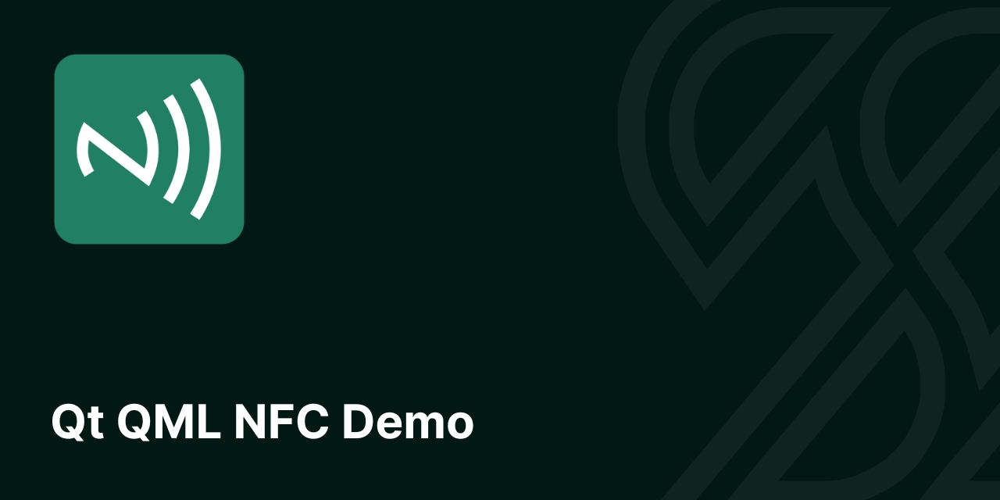

# NFC Demo
[](https://scythe-studio.com/blog/nfc-in-qt-qml-application)
This demo presents how to use NFC for communication using Qt framework on mobile platform. Application has simple UI and logic that can be an example of creative NFC usage. Demo presents following features:

- NFC tags detection
- NFC tags reading
- NFC tags writing
- Exposing C++ to Qml to build creative cooking mobile app 🍗 🍳

---

[](https://scythe-studio.com)

[](https://qt.io)

---

## How to use NFC in Qt/Qml application?
If you need more detailed blog post on NFC topic you can read this 
[blog post on Scythe Studio blog](https://scythe-studio.com/blog/nfc-in-qt-qml-application). Here we will talk only about NFC tags detection.

### NFC tags detection
We created a NFCManager class that among other members and methods, have important QNearFieldManager instance saved. Connecting to this object is crucial to control detection and handle signals.

```cpp
// directives, forward declarations, structure declaration

class NFCManager : public QObject
{
    Q_OBJECT
    // properties
    QML_ELEMENT

public:
    explicit NFCManager(QObject *parent = nullptr);

    // ...

public slots:
    void startReading();
    void stopDetecting();
    void saveRecord(const QString &dishName, int seconds);

signals:
    // ...
    void recordChanged(const Record &record);
    void wroteSuccessfully();
    void nfcError(const QString &error);

private slots:
    // ...
    void onTargetDetected(QNearFieldTarget *target);
    void onTargetLost(QNearFieldTarget *target);

    void onNdefMessageRead(const QNdefMessage &message);
    void onNdefMessageWritten();
    void handleTargetError(QNearFieldTarget::Error error, const QNearFieldTarget::RequestId &id);

private:
    // ...
    QNearFieldManager *m_manager;
    QNearFieldTarget::RequestId m_request;
};

#endif // NFCMANAGER_H

```

Then we connect to register slots for two important signals emitted by QNearFieldManager instance. The first one - targetDetected, is emitted when target device (device, tag, card) goes into a range. When target device leaves communication range, targetLost signal is emitted.

```cpp
NFCManager::NFCManager(QObject *parent)
    : QObject(parent)
    , m_manager(new QNearFieldManager(this))
{

    connect(m_manager, &QNearFieldManager::targetDetected,
            this, &NFCManager::onTargetDetected);
    connect(m_manager, &QNearFieldManager::targetLost,
            this, &NFCManager::onTargetLost);
}
```

And that's pretty it. This way you can detect tags, but before you will see slots executed, you need to ask QNearFieldManager to start detection. You start detection by calling `startTargetDetection()` method on manager, but first set target access mode by calling `setTargetAccessModes(mode)`.

```cpp
void NFCManager::startReading()
{
    // ...
    m_manager->setTargetAccessModes(QNearFieldManager::NdefReadTargetAccess);
    m_manager->startTargetDetection();
}

void NFCManager::stopDetecting()
{
    // ...
    m_manager->setTargetAccessModes(QNearFieldManager::NoTargetAccess);
    m_manager->stopTargetDetection();
}
```

Once you are done with your NFC feature you can call `stopTargetDetection()` to prevent future NFC target events. 

Yeah so that's it. This Readme is already too long, so feel free to visit our blog to discover how to actually read and write messages from/on NFC tags.

## About Scythe Studio
We’re a team of **Qt and C++ enthusiasts** dedicated to helping businesses build great cross-platform applications. As an official Qt Service Partner, we’ve earned the trust of companies across various industries by delivering high-quality, reliable solutions. With years of experience in **Qt and QML development**, we know how to turn ambitious ideas into outstanding products.

<table style="margin: 0 auto; border:0;">
    <tr style="border:0">
        <td style="border:0">
            <a href="https://scythe-studio.com">
                
            </a>
        </td>
        <td style="border:0">
            <a href="https://clutch.co/profile/scythe-studio">
                
            </a>
        </td>
        <td style="border:0">
            <a href="https://scythe-studio.com/en/iso">
                
            </a>
        </td>
        <td style="border:0">
            <a href="https://scythe-studio.com/en/iso">
                
            </a>
        </td>
    </tr>
</table>

We offer a wide range of services—from brainstorming ideas to delivering polished applications—always tailored to our clients’ needs. By combining deep knowledge of Qt modules and modern technologies with a practical, cost-effective approach, we create solutions that truly make a difference.

## Professional Support
Need help with anything? We’ve got you covered. Our professional support services are here to assist you with. For more details about support options and pricing, just drop us a line at https://scythe-studio.com/en/contact.

## Follow us
Check out those links if you want to see Scythe Studio in action and follow the newest trends saying about Qt Qml development.

* 🌐 [Scythe Studio Website](https://scythe-studio.com/en/)
* ✍️  [Scythe Studio Blog Website](https://scythe-studio.com/en/blog)
* 👔 [Scythe Studio LinkedIn Profile](https://www.linkedin.com/company/scythestudio/mycompany/)
* 👔 [Scythe Studio Facebook Page](https://www.facebook.com/ScytheStudiio)
* 🎥 [Scythe Studio Youtube Channel](https://www.youtube.com/channel/UCf4OHosddUYcfmLuGU9e-SQ/featured)
